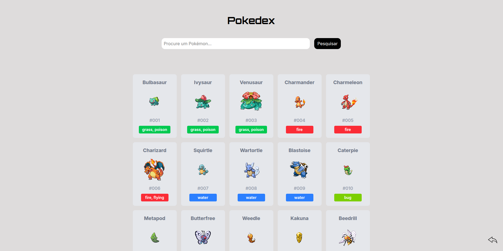

# Pokedex

## Sobre o projeto

Este projeto é um projeto front end desenvolvido em React e Tailwind. Com o objetivo de buscar Pokémon por nome e id.
Meu projeto tem um design minimalista, responsivo e interativo.
Foi criado para desenvolver habilidades e ser adicionado no meu portfólio

## Funcionalidades

- Busca de Pokémon por nome ou ID
- Design responsivo
- Interface rápida e interativa

## Tecnologias utilizadas

- React
- Tailwind CSS
- Vite

## Como rodar

- git clone https://github.com/renanmiguel2/Pokedex
- cd Pokedex
- npm install
- npm run dev

## Requisitos 
Vite 7
Node.js 

## Acesse meu projeto

https://rnpokedex.netlify.app/